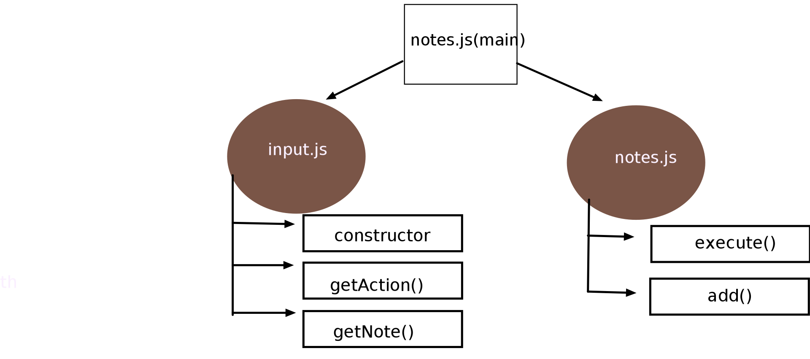

# Notes

build of an application called **Notesy** :v:

### Author: Yasmin Adaileh :sunglasses:

### Links and Resources :paperclip:

[submission PR](https://github.com/yasmin-401-advanced-javascript/notes/pull/2)

## Library Used

### Modules

#### `notes.js`

#### `input.js`

In this app I used only the **minimist** & **jsdoc**

## Instruction How to Install the Library

1. `npm i minimist` run it in the command line(Ubuntu)
1. `npm i jsdoc` run it in the command line(Ubuntu)
1. `npm i -D jest` run it in the command line(Ubuntu)


## How to run the app? :runner:

in the **Ubuntu** just type:
`npm test`

## UML

# 

# Understanding for me.

## Realted to class :one:

### What is Node.js?

It is a platform built on Chrome's JavaScript **runtime** for easily building fast and scalable network applications.

```
Running JavaScript **without/outside a browser** means:
   - using **node.js technology** to execute the JavaScript code.
```

### What is Modular Programming?

In Node, the **modularity** is a **first-class concept**. In the Node.js module system, each file is **treated** as a separate module. Basically modules help us **encapsulating** our code into **manageable chunks**

**Types of Module:**

1. **Core module**: Modules that come **shipped with Node.js**, e.g. `https`, `os`, `fs`, `net`, etc.
1. **Third-party module**: Modules that **you install** from any package manager.
1. **Local module**: These are the modules that **we create** for our own use.

**Benifets of using the moduls:**

1. make code **Reusable**
1. for **testing**

**httpi** it is a **command line tool** do what superagent do.

**Library** used :

1. `"is-url"`: `"^1.2.4"`
2. `"minimist"`: `"^1.2.5"`

### 1st Party/3rd party library

1. **1st party**: JS loaded from the **same location** as the webpage.
1. **3rd party**: JS loaded from **different location** as the webpage is considered to be 3rd party.

**minimist library** used to read command line arguments
----------------------------------
## Realted to class :two:

### What is Test-Driven Development (TDD)?

it's a process where you start with coding your test then after that you will be able to start the real code to pass the test you've been written. This will help as to check against our test when we're going to do a big refactor and this will make you know where it has failed and where it passes.

### what we need to do the testing?

Wn need to install a new **dependency** called **jest** as a dev dependency this mean its require to use when we're developing but when we're deploying and running on another potential server it shouldn't install the dev dependency.

`npm i -D jest` run it in the command line(Ubuntu)

Whenever we install it we need to add script in our `package.josn` to tell our application to run this script to test.

in the package.josn file at the script object there is a test key we will change the value of it into
`"jest --coverage --verbose"`
**coverage** it will show you the **coverage record**
**verbose** it will give you more **explanation** about the test.

the file we'll write inside it the test should have **.test.js** extantion.

[jest Method resources](https://jestjs.io/docs/en/expect)
[jest object resources](https://jestjs.io/docs/en/jest-object)
-----------------------------------------------------

`jest.spyOn(object, methodName)`

If you want to overwrite the original function, you can use

`jest.spyOn(object, methodName).mockImplementation(() => customImplementation)`
or
`object[methodName] = jest.fn(() => customImplementation);`

**Example**

```
const video = {
play() {
  return true;
},
};

module.exports = video;
```

**Example test:**

```
const video = require('./video');

test('plays video', () => {
  const spy = jest.spyOn(video, 'play');
  const isPlaying = video.play();

  expect(spy).toHaveBeenCalled();
  expect(isPlaying).toBe(true);

  spy.mockRestore();
});
```
in our lab we want to spy over the **console**. The **console** is in the `global` **object** and the **method** will be `'log'`

`jest.spyOn(global.console , 'log')`

**without the spyOn** it will faild and we will see in the console 
`value must be  a mock or spy function`

this will give as the ablity to know if it's was called or not
then the 
```
describe ( 'what we are describing and this is a static statement', ()=> { 
   it(' dose nothing when execute() is called with invalied message ' , () => {

   })
})
```
after run the npm test we'll see this 
```
 notes module \\ this is comming from the describe
    ✓  dose nothing when execute() is called with invalied message  (7 ms) \\ this is comming from the it
```
this is for the notes.js
-----------------------------------------

`jest.mock(minimist)` 
which mean we are mocking the minimist library and we will give it a mock implementation.

minimiest.mockImplementation(()=>{

})

Modules that are **mocked** with `jest.mock` are mocked only for the file that calls jest.mock. Another file that imports the module will get the original implementation even if it runs after the test file that mocks the module.

Returns the jest object for chaining.

**Example:**
```
// banana.js
module.exports = () => 'banana';

// __tests__/test.js
jest.mock('../banana');

const banana = require('../banana'); // banana will be explicitly mocked.

banana(); // will return 'undefined' because the function is auto-mocked.
```
mock..
---------------------------------------------------

